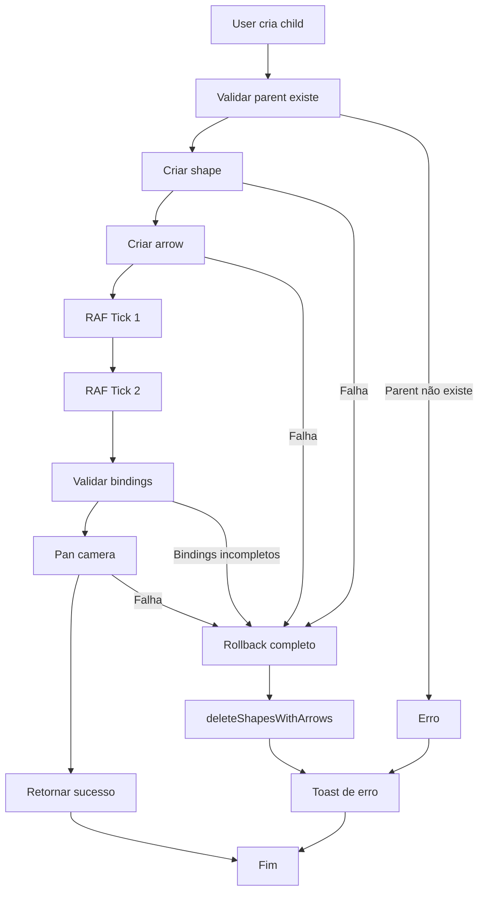

# Transaction Pattern for Shape Creation

## Contexto

Atualmente, ao criar um child shape, o código pode entrar em estados inconsistentes:

- Shape criado mas arrow falha → shape órfão sem conexão
- Arrow criada mas bindings incompletos → estado inválido
- Rollback deleta apenas shape, arrow permanece órfã

Vamos implementar um **Transaction Pattern** que garante atomicidade: tudo sucede ou tudo é revertido.

## Arquitetura da Solução



## Mudanças Fundamentais

### 1. Signature Async

`createChildShape()` será **async** para permitir double RAF conservador:

```typescript
// ANTES (sync)
export function createChildShape(
  editor: Editor,
  parentId: TLShapeId,
  childType: ShapeType
): { childId: TLShapeId; arrowId: TLShapeId } | null

// DEPOIS (async)
export async function createChildShape(
  editor: Editor,
  parentId: TLShapeId,
  childType: ShapeType
): Promise<{ childId: TLShapeId; arrowId: TLShapeId }>
```

**Impacto:** Todos os locais que chamam `createChildShape()` precisam usar `await`.

### 2. Error Handling

Lança exceção ao invés de retornar `null`, para componente capturar e mostrar toast:

```typescript
// ANTES
const result = createChildShape(editor, parentId, 'note')
if (!result) {
  console.error('Failed')
  return
}

// DEPOIS
try {
  const result = await createChildShape(editor, parentId, 'note')
  // sucesso
} catch (error) {
  toast.error('Failed to create shape')
}
```

### 3. FlowId Propagation

FlowId é gerenciado pelo componente, não pelo util:

- Se parent tem flowId → child herda
- Se parent não tem → gerar novo, child recebe
- Parent NUNCA é atualizado (responsabilidade do componente)

## Implementação Detalhada

### Fase 1: Cascade Delete Utilities

Implementar em [`src/utils/shapeDelete.ts`](src/utils/shapeDelete.ts) (arquivo novo):

```typescript
import { Editor, type TLShapeId } from 'tldraw'

/**
 * Encontra todas as arrows conectadas aos shapes.
 */
function findConnectedArrows(
  editor: Editor,
  shapeIds: Set<TLShapeId>
): Set<TLShapeId> {
  const arrowsToDelete = new Set<TLShapeId>()
  const allShapes = editor.getCurrentPageShapes()
  
  for (const shape of allShapes) {
    if (shape.type !== 'arrow') continue
    
    const start = shape.props.start
    const end = shape.props.end
    
    const startConnectsToDeleted = 
      start?.type === 'binding' && shapeIds.has(start.boundShapeId)
    const endConnectsToDeleted = 
      end?.type === 'binding' && shapeIds.has(end.boundShapeId)
    
    if (startConnectsToDeleted || endConnectsToDeleted) {
      arrowsToDelete.add(shape.id)
    }
  }
  
  return arrowsToDelete
}

/**
 * Deleta shapes e suas arrows (cascade).
 * Performance: O(N) - scan único + batch delete.
 */
export function deleteShapesWithArrows(
  editor: Editor,
  shapeIds: TLShapeId[]
): void {
  if (shapeIds.length === 0) return
  
  const shapeIdsSet = new Set(shapeIds)
  const arrowsToDelete = findConnectedArrows(editor, shapeIdsSet)
  
  const allIdsToDelete = [
    ...Array.from(arrowsToDelete),
    ...shapeIds,
  ]
  
  editor.deleteShapes(allIdsToDelete)
}

/**
 * Wrapper para single shape.
 */
export function deleteShapeWithArrows(
  editor: Editor,
  shapeId: TLShapeId
): void {
  deleteShapesWithArrows(editor, [shapeId])
}
```

### Fase 2: Custom Error Class

Adicionar em [`src/utils/shapeChildCreation.ts`](src/utils/shapeChildCreation.ts):

```typescript
/**
 * Erro customizado para criação de shapes.
 * Permite componente identificar tipo de erro e mostrar mensagem apropriada.
 */
export class ShapeCreationError extends Error {
  constructor(
    message: string,
    public code: 'PARENT_NOT_FOUND' | 'SHAPE_CREATION_FAILED' | 
                 'ARROW_CREATION_FAILED' | 'INVALID_BINDINGS' | 
                 'PAN_CAMERA_FAILED',
    public details?: any
  ) {
    super(message)
    this.name = 'ShapeCreationError'
  }
}
```

### Fase 3: Refatorar createChildShape() - Transaction Pattern

Refatorar [`src/utils/shapeChildCreation.ts`](src/utils/shapeChildCreation.ts):

```typescript
import { deleteShapeWithArrows } from './shapeDelete'

/**
 * Aguarda dois animation frames (conservador).
 * Garante que store do tldraw atualizou completamente.
 */
async function waitForStoreUpdate(): Promise<void> {
  return new Promise(resolve => {
    requestAnimationFrame(() => {
      requestAnimationFrame(resolve)
    })
  })
}

/**
 * Cria child shape com arrow (transacional).
 * 
 * Garante atomicidade:
 * - Todas as operações sucedem OU
 * - Rollback completo (deleta shape + arrow)
 * 
 * @throws {ShapeCreationError} Se qualquer etapa falhar
 */
export async function createChildShape(
  editor: Editor,
  parentId: TLShapeId,
  childType: ShapeType
): Promise<{ childId: TLShapeId; arrowId: TLShapeId }> {
  
  let createdShapeId: TLShapeId | null = null
  let createdArrowId: TLShapeId | null = null
  
  try {
    // === FASE 1: VALIDAÇÃO ===
    const parent = editor.getShape(parentId)
    if (!parent) {
      throw new ShapeCreationError(
        'Parent shape not found',
        'PARENT_NOT_FOUND'
      )
    }
    
    // === FASE 2: PREPARAÇÃO ===
    // FlowId: herdar do parent ou criar novo
    const parentFlowId = parent.props.flowId || crypto.randomUUID()
    
    // Calcular posição
    const childrenCount = getChildrenCount(editor, parentId)
    const childWidth = childType === 'note' ? 300 : 400
    const position = calculateChildPosition(parent, childrenCount, childWidth)
    
    const childId = createShapeId()
    
    // === FASE 3: CRIAR SHAPE ===
    try {
      editor.createShape({
        id: childId,
        type: childType,
        x: position.x,
        y: position.y,
        props: {
          flowId: parentFlowId, // Herdar flowId (parent não é atualizado)
        },
      })
      createdShapeId = childId
    } catch (error) {
      throw new ShapeCreationError(
        'Failed to create shape',
        'SHAPE_CREATION_FAILED',
        { originalError: error }
      )
    }
    
    // === FASE 4: CRIAR ARROW ===
    try {
      const arrowId = createArrow(editor, parentId, childId)
      createdArrowId = arrowId
    } catch (error) {
      throw new ShapeCreationError(
        'Failed to create arrow',
        'ARROW_CREATION_FAILED',
        { originalError: error }
      )
    }
    
    // === FASE 5: VALIDAR BINDINGS (CONSERVADOR) ===
    // Aguardar dois RAF para garantir store atualizado
    await waitForStoreUpdate()
    
    const bindingStatus = checkArrowBindings(editor, createdArrowId)
    if (!bindingStatus.hasBothBindings) {
      throw new ShapeCreationError(
        'Arrow bindings incomplete',
        'INVALID_BINDINGS',
        { bindingStatus }
      )
    }
    
    // === FASE 6: PAN CAMERA ===
    // Parte da transação (falha causa rollback)
    try {
      const childShape = editor.getShape(childId)
      if (childShape) {
        const childBounds = editor.getShapePageBounds(childId)
        if (childBounds) {
          editor.centerOnPoint(childBounds.center, { 
            animation: { duration: 300 } 
          })
        }
      }
    } catch (error) {
      throw new ShapeCreationError(
        'Failed to pan camera',
        'PAN_CAMERA_FAILED',
        { originalError: error }
      )
    }
    
    // === SUCESSO ===
    return { 
      childId: createdShapeId, 
      arrowId: createdArrowId 
    }
    
  } catch (error) {
    // === ROLLBACK COMPLETO ===
    console.error('Shape creation failed, rolling back:', error)
    
    if (createdShapeId || createdArrowId) {
      try {
        const shapesToDelete = [createdShapeId, createdArrowId].filter(
          (id): id is TLShapeId => id !== null
        )
        
        if (shapesToDelete.length > 0) {
          deleteShapeWithArrows(editor, shapesToDelete[0])
          // Se múltiplos, deletar todos
          if (shapesToDelete.length > 1) {
            deleteShapeWithArrows(editor, shapesToDelete[1])
          }
        }
      } catch (rollbackError) {
        console.error('Rollback failed:', rollbackError)
      }
    }
    
    // Re-throw para componente capturar e mostrar toast
    throw error
  }
}
```

### Fase 4: Integrar react-hot-toast

Instalar dependência:

```bash
pnpm add react-hot-toast
```

Atualizar componente que chama `createChildShape()` (provavelmente em [`src/components/shapes/AddChildButton.tsx`](src/components/shapes/AddChildButton.tsx)):

```typescript
import toast from 'react-hot-toast'
import { ShapeCreationError } from '../../utils/shapeChildCreation'

// No handler de click:
const handleAddChild = async () => {
  try {
    const result = await createChildShape(editor, parentId, childType)
    // Sucesso - opcionalmente mostrar toast de sucesso
    // toast.success('Shape created')
  } catch (error) {
    if (error instanceof ShapeCreationError) {
      toast.error(`Failed to create shape: ${error.message}`)
    } else {
      toast.error('Failed to create shape')
    }
    console.error(error)
  }
}
```

Setup do Toaster no root (provavelmente [`src/main.tsx`](src/main.tsx)):

```typescript
import { Toaster } from 'react-hot-toast'

// No render:
<>
  <App />
  <Toaster position="bottom-right" />
</>
```

### Fase 5: Override Delete Command

Integrar cascade delete no canvas. Atualizar [`src/views/CanvasView.tsx`](src/views/CanvasView.tsx):

```typescript
import { deleteShapesWithArrows } from '../utils/shapeDelete'

<Tldraw
  onMount={(editor) => {
    // Setup cascade delete
    const handleDelete = () => {
      const selectedIds = editor.getSelectedShapeIds()
      if (selectedIds.length > 0) {
        deleteShapesWithArrows(editor, selectedIds)
        editor.setSelectedShapes([])
        return true // Prevent default
      }
      return false
    }
    
    // Register keyboard shortcuts
    editor.registerKeyboardShortcut('delete', handleDelete)
    editor.registerKeyboardShortcut('backspace', handleDelete)
  }}
  overrides={{
    actions: (editor, actions) => ({
      ...actions,
      'delete-shapes': {
        ...actions['delete-shapes'],
        onSelect: () => {
          const selectedIds = editor.getSelectedShapeIds()
          if (selectedIds.length > 0) {
            deleteShapesWithArrows(editor, selectedIds)
            editor.setSelectedShapes([])
          }
        },
      },
    }),
  }}
>
  {/* Canvas UI */}
</Tldraw>
```

## Testes E2E - Suite Completa

### Helper para Contar Arrows

Adicionar em [`tests/e2e/helpers/test-utils.ts`](tests/e2e/helpers/test-utils.ts):

```typescript
/**
 * Conta arrows conectadas a um shape.
 */
export async function countArrowsConnectedTo(
  page: Page,
  shapeSelector: string
): Promise<number> {
  return await page.evaluate((selector) => {
    const editor = (window as any).editor
    if (!editor) return 0
    
    const shapes = editor.getCurrentPageShapes()
    const arrows = shapes.filter((s: any) => {
      if (s.type !== 'arrow') return false
      const start = s.props.start
      const end = s.props.end
      
      // Simplificado: conta arrows que conectam ao shape
      return (start?.type === 'binding' || end?.type === 'binding')
    })
    
    return arrows.length
  }, shapeSelector)
}

/**
 * Valida bindings de uma arrow em detalhes.
 */
export async function validateArrowBindings(
  page: Page,
  arrowId: string,
  expectedStart: string,
  expectedEnd: string
): Promise<boolean> {
  return await page.evaluate(
    ([id, start, end]) => {
      const editor = (window as any).editor
      if (!editor) return false
      
      const arrow = editor.getShape(id)
      if (!arrow || arrow.type !== 'arrow') return false
      
      const bindings = editor.getBindingsFromShape(id, 'arrow')
      const startBinding = bindings.find((b: any) => b.props.terminal === 'start')
      const endBinding = bindings.find((b: any) => b.props.terminal === 'end')
      
      return (
        startBinding?.toId === start &&
        endBinding?.toId === end
      )
    },
    [arrowId, expectedStart, expectedEnd]
  )
}
```

### Teste Detalhado de Bindings

Criar [`tests/e2e/shape-transactions.spec.ts`](tests/e2e/shape-transactions.spec.ts) (arquivo novo):

```typescript
import { test, expect } from '@playwright/test'
import { 
  createCanvas, 
  createNoteShape, 
  countArrowsConnectedTo,
  validateArrowBindings 
} from './helpers/test-utils'

test.describe('Shape Transaction Pattern', () => {
  
  test.describe('Binding Validation - Detailed', () => {
    test('TEST-TX-001: Chain A→B→C - all bindings correct', async ({ page }) => {
      await createCanvas(page, 'Transaction Test')
      
      // Criar chain
      await createNoteShape(page) // A
      await page.getByTestId('note-add-child-btn').click()
      await page.getByTestId('note-content').last().fill('B')
      await page.getByTestId('note-add-child-btn').last().click()
      await page.getByTestId('note-content').last().fill('C')
      
      // Validar bindings detalhadamente
      const arrows = await page.evaluate(() => {
        const editor = (window as any).editor
        return editor.getCurrentPageShapes()
          .filter((s: any) => s.type === 'arrow')
          .map((a: any) => ({
            id: a.id,
            meta: a.meta
          }))
      })
      
      expect(arrows).toHaveLength(2) // A→B, B→C
      
      // Validar cada binding individualmente
      for (const arrow of arrows) {
        const parentId = arrow.meta.parentId
        const childId = arrow.meta.childId
        
        const isValid = await validateArrowBindings(
          page, 
          arrow.id, 
          parentId, 
          childId
        )
        expect(isValid).toBe(true)
      }
    })
    
    test('TEST-TX-002: Multiple children - bindings isolated', async ({ page }) => {
      await createCanvas(page, 'Multiple Children')
      
      // Parent com 3 children
      await createNoteShape(page) // Parent
      await page.getByTestId('note-add-child-btn').click() // Child 1
      await page.getByTestId('note-add-child-btn').first().click() // Child 2
      await page.getByTestId('note-add-child-btn').first().click() // Child 3
      
      const arrows = await countArrowsConnectedTo(page, 'note')
      expect(arrows).toBe(3)
      
      // Validar que cada arrow tem bindings únicos
      const bindingDetails = await page.evaluate(() => {
        const editor = (window as any).editor
        const arrows = editor.getCurrentPageShapes()
          .filter((s: any) => s.type === 'arrow')
        
        const allBindings = arrows.flatMap((a: any) => {
          const bindings = editor.getBindingsFromShape(a.id, 'arrow')
          return bindings.map((b: any) => ({
            arrowId: a.id,
            terminal: b.props.terminal,
            toId: b.toId
          }))
        })
        
        return allBindings
      })
      
      // Cada child deve ter exatamente 1 binding (como end)
      const childBindings = bindingDetails.filter(b => b.terminal === 'end')
      expect(childBindings).toHaveLength(3)
      
      // Todos os 3 devem apontar para shapes diferentes
      const uniqueChildIds = new Set(childBindings.map(b => b.toId))
      expect(uniqueChildIds.size).toBe(3)
    })
    
    test('TEST-TX-003: Multiple flows - flowId isolated', async ({ page }) => {
      await createCanvas(page, 'Multiple Flows')
      
      // Flow 1: A1 → B1
      await createNoteShape(page)
      await page.getByTestId('note-content').fill('A1')
      await page.getByTestId('note-add-child-btn').click()
      await page.getByTestId('note-content').last().fill('B1')
      
      // Flow 2: A2 → B2 (novo root)
      await createNoteShape(page)
      await page.getByTestId('note-content').last().fill('A2')
      await page.getByTestId('note-add-child-btn').last().click()
      await page.getByTestId('note-content').last().fill('B2')
      
      // Validar flowIds diferentes
      const flowIds = await page.evaluate(() => {
        const editor = (window as any).editor
        const notes = editor.getCurrentPageShapes()
          .filter((s: any) => s.type === 'note')
        
        return notes.map((n: any) => ({
          content: n.props.text || '',
          flowId: n.props.flowId
        }))
      })
      
      const flow1Ids = flowIds
        .filter(n => n.content.includes('1'))
        .map(n => n.flowId)
      const flow2Ids = flowIds
        .filter(n => n.content.includes('2'))
        .map(n => n.flowId)
      
      // Cada flow deve ter flowId único
      expect(new Set(flow1Ids).size).toBe(1)
      expect(new Set(flow2Ids).size).toBe(1)
      
      // Flows devem ser diferentes
      expect(flow1Ids[0]).not.toBe(flow2Ids[0])
    })
  })
  
  test.describe('Rollback on Failure', () => {
    test('TEST-TX-004: Shape creation fails - no orphan arrow', async ({ page }) => {
      // Mock createShape para falhar
      await page.addInitScript(() => {
        let callCount = 0
        const original = (window as any).editor?.createShape
        if (original) {
          (window as any).editor.createShape = function(...args: any[]) {
            callCount++
            if (callCount === 2) { // Falhar no segundo shape (child)
              throw new Error('Mocked failure')
            }
            return original.apply(this, args)
          }
        }
      })
      
      await createCanvas(page, 'Rollback Test')
      await createNoteShape(page)
      
      // Tentar criar child (deve falhar)
      await page.getByTestId('note-add-child-btn').click()
      
      // Aguardar toast de erro
      await expect(page.getByText(/failed to create/i)).toBeVisible()
      
      // Validar que não há arrows órfãs
      const arrowCount = await countArrowsConnectedTo(page, 'note')
      expect(arrowCount).toBe(0)
    })
  })
  
  test.describe('Cascade Delete Integration', () => {
    test('TEST-TX-005: Delete shape deletes arrow', async ({ page }) => {
      await createCanvas(page, 'Cascade Delete')
      
      // Criar parent → child
      await createNoteShape(page)
      await page.getByTestId('note-add-child-btn').click()
      
      const arrowsBefore = await countArrowsConnectedTo(page, 'note')
      expect(arrowsBefore).toBe(1)
      
      // Deletar child
      await page.getByTestId('note-content').last().click()
      await page.keyboard.press('Delete')
      
      const arrowsAfter = await countArrowsConnectedTo(page, 'note')
      expect(arrowsAfter).toBe(0) // Arrow também deletada
    })
    
    test('TEST-TX-006: Delete multiple shapes deletes all arrows', async ({ page }) => {
      await createCanvas(page, 'Cascade Multiple')
      
      // Criar A → B → C
      await createNoteShape(page)
      await page.getByTestId('note-add-child-btn').click()
      await page.getByTestId('note-add-child-btn').last().click()
      
      // Selecionar todos e deletar
      await page.keyboard.press('Control+A')
      await page.keyboard.press('Delete')
      
      const shapesCount = await page.evaluate(() => {
        const editor = (window as any).editor
        return editor.getCurrentPageShapes().length
      })
      
      expect(shapesCount).toBe(0) // Tudo deletado (shapes + arrows)
    })
  })
})
```

### Testes Simples (Só Existência de Arrow)

Atualizar testes existentes em [`tests/e2e/note-shape.spec.ts`](tests/e2e/note-shape.spec.ts), [`tests/e2e/question-shape.spec.ts`](tests/e2e/question-shape.spec.ts), etc:

```typescript
// Simplificar validação (não checar bindings detalhadamente)
test('should create child with arrow', async ({ page }) => {
  await createNoteShape(page)
  await page.getByTestId('note-add-child-btn').click()
  
  // Validar apenas existência
  const arrowCount = await countArrowsConnectedTo(page, 'note')
  expect(arrowCount).toBeGreaterThan(0) // Arrow existe
})
```

## Checklist de Implementação

1. Cascade Delete

            - Criar `src/utils/shapeDelete.ts`
            - Implementar `findConnectedArrows()`, `deleteShapesWithArrows()`

2. Transaction Pattern

            - Adicionar `ShapeCreationError` class
            - Refatorar `createChildShape()` para async
            - Implementar `waitForStoreUpdate()` helper
            - Adicionar validação de bindings pós-criação
            - Implementar rollback completo

3. Toast Integration

            - Instalar `react-hot-toast`
            - Setup Toaster no root
            - Atualizar `AddChildButton` para capturar erros e mostrar toast

4. Delete Override

            - Integrar cascade delete em `CanvasView`
            - Override keyboard shortcuts (Delete/Backspace)
            - Override UI action ('delete-shapes')

5. Testes E2E

            - Criar helpers: `countArrowsConnectedTo()`, `validateArrowBindings()`
            - Criar `shape-transactions.spec.ts` com testes detalhados
            - Atualizar testes existentes para usar helpers simplificados

6. Validação

            - Testar manualmente todas as operações
            - Validar undo/redo funciona corretamente
            - Validar performance com múltiplos shapes

## Riscos e Mitigações

**Risco 1:** Tornar `createChildShape()` async quebra compatibilidade

- **Mitigação:** Identificar todos os locais que chamam e atualizar com `await`

**Risco 2:** Double RAF pode não ser suficiente em ambientes lentos

- **Mitigação:** Se necessário, adicionar terceiro RAF ou usar `waitForTimeout()` fallback

**Risco 3:** Pan camera pode falhar e causar rollback desnecessário

- **Mitigação:** Pan camera está explicitamente na transação conforme requisito

**Risco 4:** Toast pode não funcionar se sistema de notificações não estiver configurado

- **Mitigação:** Setup do Toaster é parte obrigatória da implementação